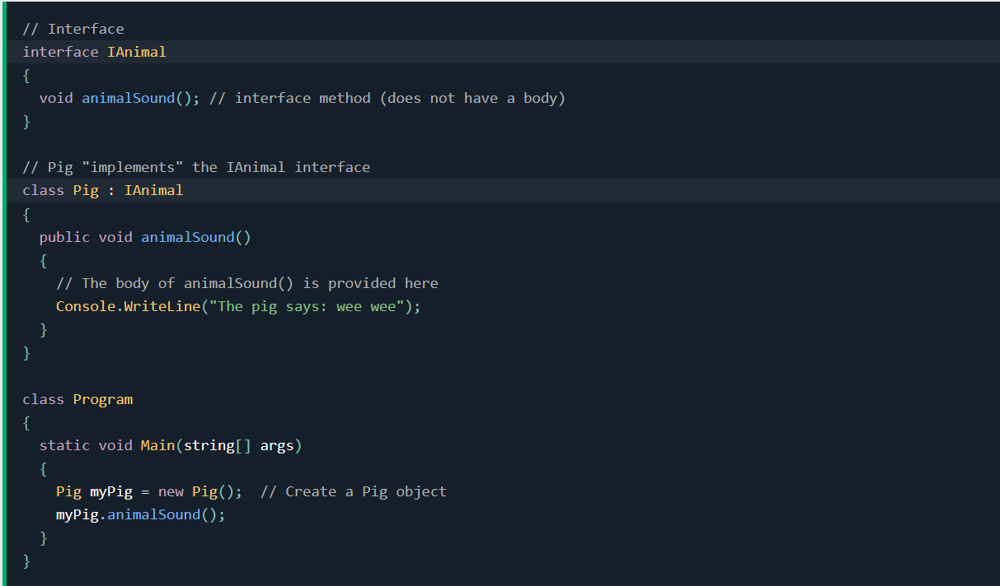

# Interfaces

- We can say the interface is a ***contract*** that defines the behavior of a **class** or **struct**. It contains ***only the declaration of members***, such as methods, properties, events, and indexers, but not their implementation. The implementation is provided by the class or struct that implements the interface.[READ MORE](https://learn.microsoft.com/en-us/dotnet/csharp/language-reference/keywords/interface)

- Interfaces can’t have private members and all members are public and abstract by default. They can’t contain fields because they represent a particular implementation of data.[READ MORE](https://www.geeksforgeeks.org/c-sharp-interface/)

- To access the interface methods, the interface must be **"implemented"** (kinda like inherited) by another class. To implement an interface, use the `:` symbol (just like with inheritance). The body of the interface method is provided by the "implement" class.[READ MORE](https://www.w3schools.com/cs/cs_interface.php)

- Code example:

- Multiple Interfaces

To implement multiple interfaces, separate them with a comma `,` .

